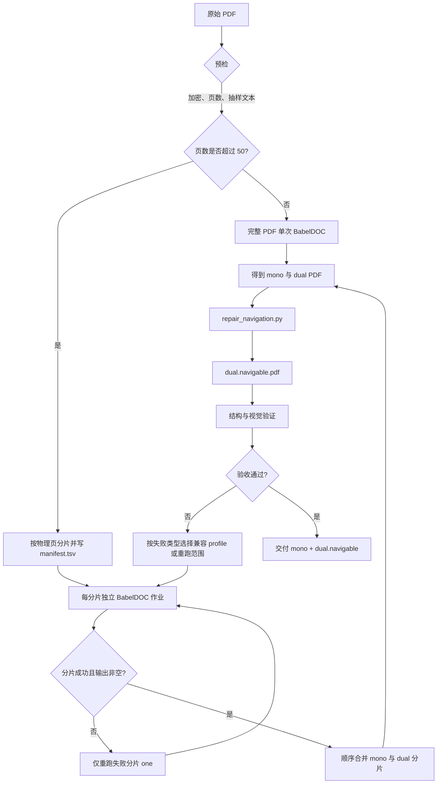
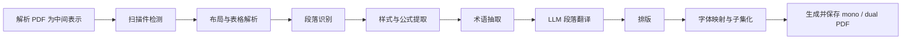
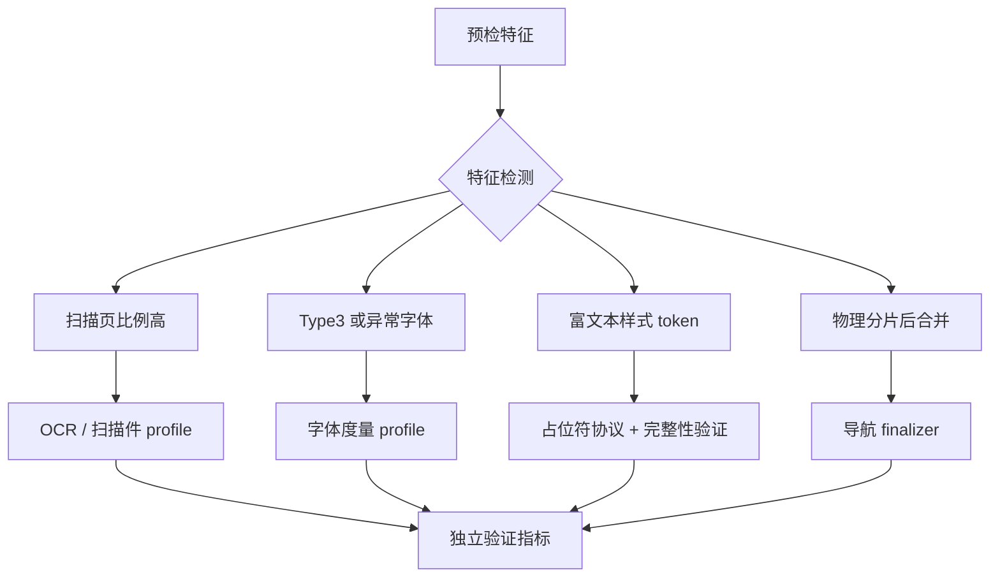

# 本地双语 PDF 交付与兼容性工作流

> 本文描述 `/Users/hulj/tools_wp/babeldoc` 的本地运行工作流，而非 BabelDOC
> 对外稳定 API。模型配置文件 `babeldoc.ko-zh.toml` 含私有凭据：不得在文档、日志、
> 提交或命令行中复制其内容。

## 目标与边界

交付物是同页双栏的中英/中韩双语 PDF，以及可导航版本：

- **mono PDF**：只含译文；
- **dual PDF**：每页左侧为原文、右侧为译文；
- **dual.navigable PDF**：在 dual PDF 中间产物上恢复原始目录书签和左侧原文页的内部链接；这是唯一保留的最终双语交付物，
  是阅读交付物。

本地工具负责编排、重试、合并、修复导航和质量验证；BabelDOC 主程序负责解析、
翻译和排版。两者不应互相混入。特别是，导航修复是合并后的 finalizer，不应被塞进
OCR、翻译提示词或字体兼容逻辑中。

## 组件职责

| 组件 | 职责 | 输入 | 输出/副作用 |
| --- | --- | --- | --- |
| `babeldoc` CLI | PDF 解析、布局分析、段落/样式/公式处理、LLM 翻译、排版、生成 mono/dual PDF | 物理 PDF 分片或完整 PDF | PDF、working directory、翻译追踪数据 |
| `translate-chunks.zsh` | 长书物理分片、已完成分片跳过、单分片重试、有限并行、按顺序合并 | 原始 PDF、环境变量 | `work/input-chunks/`、`work/chunks/`、`output/chunks/` |
| `translate-book.zsh` | 历史的单书/小页段测试启动器；用物理小 PDF 避开 `--pages` 与内部拆分的组合问题 | 原始 PDF、页码范围 | `work/samples/`、`output/` |
| `prompts/en-zh-technical.txt` | 英文技术书的本地提示词：保留代码、文件名、API、公式和约定英文术语 | 翻译请求 | 传给 CLI 的系统提示词 |
| `glossaries/` | 可编辑的术语约束数据 | 本地配置 | 术语抽取/翻译行为 |
| `repair_navigation.py` | 从原 PDF 复制目录并恢复内部链接：左侧原文精确缩放；右侧中文仅在附近找到相同引文/编号时添加链接 | source PDF、dual PDF | 新的 `.dual.navigable.pdf`；不覆盖 dual 输入 |

## 端到端处理流程



### 1. 预检

在发起翻译前，用 PyMuPDF 检查：

1. 文件是否存在、能否打开、是否加密；
2. 页数；
3. 标题页、目录页、正文页的可选择文本；
4. 是否存在扫描页、异常字体、旋转页、目录/内部链接和复杂表格。

有文本层的 PDF 默认不启用 OCR。预检只决定运行 profile 和验证重点，不能因为文件名
或主观猜测而改变全局配置。

### 2. 选择运行路径

| 条件 | 路径 | 默认建议 | 重试粒度 |
| --- | --- | --- | --- |
| 不超过 50 页 | 直接 CLI，`--max-pages-per-part 0` | 单次运行 | 整本或物理小样本 |
| 超过 50 页 | `prepare` → `parallel` → `merge` | 100 页/片、3 并发 | 单片 |
| 更重视恢复能力 | 长书分片 | 50 页/片、5 并发 | 单片，边界更多 |
| 内存压力大 | 长书分片 | 50 页/片、2 并发 | 单片，速度较低 |

并发最多为 5，除非有明确人工决定。模型上下文不是分片大小的限制；分片主要影响本地
布局工作、单次运行时长和失败后的恢复范围。

### 3. 长书编排

`translate-chunks.zsh prepare` 使用 PyMuPDF 从原始 PDF 建立物理分片，并在
`work/input-chunks/<book>/manifest.tsv` 写入分片序号、页码范围和路径。不要使用
BabelDOC 的页码范围参数代替物理分片。

每个分片都有独立的输出目录、工作目录和 `run.log`。若已存在非空的 `.dual.pdf`，脚本
默认跳过该分片；只有显式设置 `BABELDOC_FORCE_RERUN=1` 才会重新生成。出现坏页或
空双语 PDF 时，使用 `one SOURCE INDEX` 只替换该片，然后再次执行 `merge`，而不是重译
已经成功的部分。

合并阶段严格按 manifest 顺序合并两个系列：`*.dual.pdf` 和 `*.mono.pdf`。合并本身会
重建 PDF，因此不能假定原始目录、书签或内部注释链接仍然存在。

### 4. BabelDOC 主链路



样式与公式步骤会将不可直接翻译的片段替换为占位符。翻译器返回文本后，解析器恢复这些
片段并将正常文本交给排版器。

### 5. 样式占位符：当前兼容性案例

历史上富文本样式使用 `<style id='N'>…</style>`。模型可能把 `style` 当作自然语言，
使它变成 `<风格>` 并把内部控制标记泄漏到最终 PDF。

当前分支的协议改为不透明 token：

```text
{{bdoc_style_7}}需要保留样式的文本{{/bdoc_style}}
```

其不变量如下：

1. token 必须逐字保留，不能翻译、改名、补充或删除；
2. 左右 token 必须成对且顺序正确；
3. token 内的自然语言可以翻译；
4. 注入的 token 即使被模型损坏，也绝不能成为最终可见文本；
5. 原文中本就存在的、与占位符形状相似的普通文本必须保留。

目前的解析器会移除未配对或臆造的内部 token，以保障成品不出现标记。后续应把这种移除
同时记入 job report：视觉泄漏为零并不等于样式结构无损；若有未配对 token，应能决定是
接受样式降级还是只重跑受影响分片。

### 6. 导航恢复

`repair_navigation.py source.pdf dual.pdf dual.navigable.pdf` 做三件事：

1. 检查 source 和 dual 页数相同；
2. 复制 source 的目录（TOC/bookmarks）；
3. 枚举 source 的数值型内部链接，按双语页左半区比例缩放链接矩形与目标坐标；再在右侧
   中文页同一基线附近寻找相同的引文年份、图号或标识符。仅找到明确匹配时，才为中文文本
   写入指向中文侧目标的链接。

命名目标或字符串目标会安全跳过；中文重排后没有可确认文本匹配的链接也会安全跳过，绝不
机械镜像到可能无关的位置。输出必须是新文件，不能覆盖生成的 dual PDF。

## 兼容性补丁管理

不要按“某某 PDF”堆积特判；以**可检测特性**选择彼此独立的 compatibility profile。



每个 profile 都必须记录以下内容：

| 字段 | 含义 |
| --- | --- |
| `trigger` | 可重复检测的输入特征，不是文件名 |
| `scope` | 作用于解析、翻译、排版或后处理的哪一层 |
| `action` | 开启的选项、替换的策略或独立 finalizer |
| `invariant` | 必须仍成立的结构/视觉属性 |
| `fallback` | 失败后的最小重跑范围或安全降级 |
| `fixture` | 最小可公开/可重建的回归样本 |
| `exit criterion` | 上游修复或统一实现后可删除 profile 的条件 |

建议将通用协议代码集中到一个模块，而不是让多个 translator 复制 token 字符串和正则；
将 profile、检测与验证器同样集中。推荐的目标结构是：

```text
compat/
  placeholder_protocol.py   # 所有不可翻译 token 的唯一编码与解析规则
  profiles.py               # 特征检测和策略选择
  validators.py             # token、页数、TOC、链接、格式泄漏检查
  finalizers/
    navigation.py           # 导航恢复
tests/
  fixtures/
    rich-text/
    scanned/
    type3-font/
    outlines-links/
  compatibility-manifest.yml
docs/
  ImplementationDetails/LocalBilingualPDFWorkflow.md
```

这是一项目标结构，不要求一次性重构。新增问题时，先新增 fixture 和验收，再决定它是核心
协议修复、独立 profile，还是一次性的本地操作问题。

## 验收门槛

每一次交付至少验证：

1. source 与最终 PDF 页数相同；
2. `.dual.navigable.pdf` 的目录条目数与 source 对比；
3. 恢复的数值型内部链接数量；
4. 标题、目录、正文、每个分片边界附近的页面渲染图；
5. 含粗体/斜体的段落，以及最终 PDF/追踪数据中是否存在
   `<style`、`<风格`、`<样式` 或 `bdoc_style` 可见泄漏；
6. 已知兼容 profile 的专属不变量。

建议最终输出一个不含凭据的 `validation.json`，使每次运行的证据可比对：

```json
{
  "profiles": ["rich-text", "dual-merged"],
  "pages": {"source": 440, "final": 440},
  "toc": {"source": 123, "final": 123},
  "links": {"restored": 657},
  "placeholder_integrity": {"visible_leaks": 0, "unpaired": 0}
}
```

## Git 与 PR 约定

即使 PR 最终使用 squash merge，开发阶段仍建议按可独立验证的逻辑拆分提交：

1. 占位符协议或核心行为变化；
2. prompt/调用方更新；
3. 安全清理或 finalizer 变化；
4. 回归测试与 fixture；
5. 文档与兼容矩阵。

Squash 后主分支只有一个整洁提交，但 PR 的提交序列、文件 diff 和检查结果仍保留了审阅
证据；出现问题时可在分支上 bisect、revert 单个逻辑块或 cherry-pick。Squash 提交信息和
PR 描述应列出这些逻辑块及验证命令，不能只写“fix PDF”。

## 当前已知限制

- merged dual PDF 的中文侧目录文字链接不能可靠重建；保留侧栏目录和左侧原文链接。
- 完整性清理可防止 token 可见泄漏，但不能自动证明每一处字体样式都被无损恢复。
- 扫描件、复杂表格、异常字体和多栏版式需要各自的最小 fixture；没有 fixture 的经验性
  开关不应升级为默认行为。
